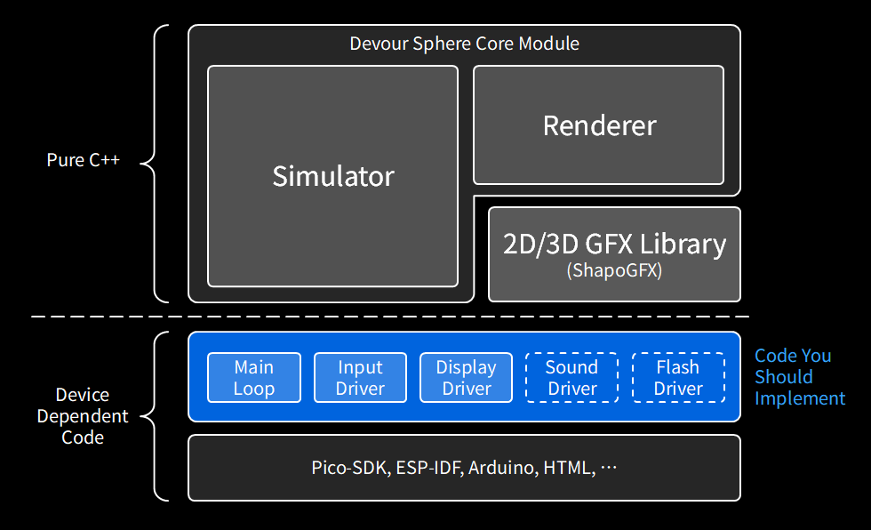

# Devour Sphere

English | [日本語](README.ja.md)

A 3D shooter played above "the Sphere", a cyberspace world: fight the other
entities, devour the fragments they drop and grow huge.
The same core program runs on embedded boards (RP2350 / RP2040 / ESP32S3 /
ESP32-P4) and in the browser (WebAssembly).

The game is a sample application written to show off [ShapoGFX](https://github.com/shapoco/shapo-gfx),
a graphics library for embedded systems. All of the drawing goes through it:
scanline 3D that needs no framebuffer, line and point primitives, 2D drawing
and fonts.

- **Play:** https://shapoco.github.io/devour-sphere/play/
- **Specifications (Japanese):** [SPEC.md](SPEC.md), [core/SPEC.md](core/SPEC.md),
  [impl/wasm/SPEC.md](impl/wasm/SPEC.md), [impl/xiamocon/SPEC.md](impl/xiamocon/SPEC.md),
  [impl/picosystem/SPEC.md](impl/picosystem/SPEC.md), [impl/m5tab5/SPEC.md](impl/m5tab5/SPEC.md),
  [impl/m5sticks3/SPEC.md](impl/m5sticks3/SPEC.md), [impl/espboy/SPEC.md](impl/espboy/SPEC.md),
  [impl/cli/SPEC.md](impl/cli/SPEC.md)

## Download

- **M5Stack Tab5:** a prebuilt firmware can be flashed straight from
  [M5Burner](https://docs.m5stack.com/en/download) — look for "Devour Sphere"
  in its ESP32-P4 (Tab5) list.
- **Other boards:** binaries for Xiamocon (RP2350 / ESP32S3), PicoSystem,
  M5StickS3 and ESPboy are
  zipped up under [Releases](https://github.com/shapoco/devour-sphere/releases);
  the README.txt inside says how to flash each one.
- **Browser:** nothing to download, just follow the Play link above.

## Controls

| Action | Keyboard | Xiamocon | PicoSystem |
|---|---|---|---|
| Turn | ← → / A D | ← → | ← → |
| Dash (costs health) | ↑ / W | ↑ | ↑ |
| Brake (turns faster) | ↓ / S | ↓ | ↓ |
| Fire / confirm | Space / J L | A / Y | A / Y |
| Emergency dodge (0.3 s invincible barrel roll, once every 3 s) | I K / C V B N M | B | B |
| Pause / resume | Esc / P | X | X |
| Toggle mute | ↓ on the title or pause screen | same | same |
| Toggle the timing overlay | (none) | ↑ on the title or pause screen, or FUNC | ↑ on the title or pause screen |

The browser version also takes a gamepad and touch input (an on-screen pad).
The M5Tab5 version is played with that same landscape pad layout: a direction
disc in the bottom left, A in the bottom right, the dodge button above and left
of it, and pause in the top right corner.

The M5StickS3 version is played by tipping the stick itself. Whichever way you
lay it on its side at start up becomes the neutral attitude; tipping it from
there steers, tipping its far edge away dashes and tipping it near brakes.
KEY1 fires, KEY2 is the emergency dodge, shaking the stick pauses, and KEY2 on
the title or pause screen shows the timing overlay.

## Build

```sh
git submodule update --init
cmake -S . -B build -DCMAKE_BUILD_TYPE=Release
cmake --build build && ctest --test-dir build
make -C impl/wasm        # the WASM version (Emscripten)
./launch_web_server.sh   # http://localhost:52980/play/
```

For [Xiamocon](https://github.com/shapoco/xiamocon) (a XIAO RP2350 / ESP32S3 handheld):

```sh
source ~/path/to/xiamocon/setup.shrc
cd impl/xiamocon/devoursphere
xmc build                      # both targets
```

For PicoSystem (RP2040), with pico-sdk alone:

```sh
cd impl/picosystem
cmake -S . -B build -DPICO_SDK_PATH=~/path/to/pico-sdk
cmake --build build -j         # build/devoursphere.uf2 (packing the sound effects needs ffmpeg and python3)
```

For [M5Stack Tab5](https://docs.m5stack.com/en/core/Tab5) (ESP32-P4), with ESP-IDF v5.5.x:

```sh
cd impl/m5tab5/devoursphere
./build.sh                     # DS_IDF_PATH defaults to ${HOME}/esp/5.5
./run.sh /dev/ttyACM0          # build and flash (the port may be omitted)
```

For [M5StickS3](https://docs.m5stack.com/en/core/M5StickS3) (ESP32-S3), with
ESP-IDF v5.5.x:

```sh
cd impl/m5sticks3/devoursphere
./build.sh                     # DS_IDF_PATH defaults to ${HOME}/esp/5.5
./run.sh /dev/ttyACM0          # build and flash (the port may be omitted)
```

For [ESPboy](https://www.espboy.com/) (ESP8266), with ESP8266_RTOS_SDK v3.4
(not Arduino; see [impl/espboy/SPEC.md](impl/espboy/SPEC.md) for the toolchain):

```sh
cd impl/espboy/devoursphere
./build.sh                     # IDF_PATH defaults to ${HOME}/esp/ESP8266_RTOS_SDK
./flash.sh /dev/ttyUSB0        # esptool over the WeMos D1 mini's USB serial
```

For a terminal (half a joke: colored ASCII art; C++17 and cmake are all it needs):

```sh
cd impl/cli
make && ./build/devoursphere   # also --mode=braille / --mode=half (see --help)
```

## How it is built

Devour Sphere comes in two layers. The **core module** on top is plain C++17
with no platform of its own: the rules of the game and the whole 3D renderer
live there. Only the layer below it is written per machine.



### The core module (what you do not have to write)

- **Simulator** ([core/src/sim/](core/src/sim/)) is the rules and the physics.
  Integer arithmetic only, so the same input gives the same result on every
  machine. It knows nothing about drawing.
- **Renderer** ([core/src/render/](core/src/render/)) reads the simulation and
  draws it with ShapoGFX. It is platform independent, but the buffer it draws
  into is handed to it from below.
- **ShapoGFX** is a library of its own (a submodule). The platform layer may
  use it directly too, for an on-screen pad or a timing overlay.

The core never allocates and never calls an OS or an SDK. A C++17 compiler is
the whole dependency.

### What a port has to provide

The **main loop, the input and the display** are required; sound and the stored
high score can be left out and the game still plays.

#### Main loop

```cpp
#include "devoursphere/devoursphere.hpp"
namespace ds = devoursphere;
namespace g2 = shapoco::gfx2d;

static ds::sim::Game game;            // ~84 KB -- never on a stack
static ds::render::Renderer renderer; // ~24 KB
static uint8_t arena[64 * 1024];      // working memory of the 3D renderer
static uint8_t band[W * BAND_H * 2];  // a band, not a frame buffer

renderer.init(W, H, arena, sizeof(arena));
game.reset(seed);

for (;;) {
  while (tickIsDue()) {          // fixed rate (60 Hz by default)
    game.tick(readButtons());    // the input driver
    renderer.pollEffects(game);
    playSounds(game.sounds());   // the sound driver (optional)
  }
  renderer.beginFrame(game, dt); // camera and scene for this frame
  for (int y = 0; y < H; y += BAND_H) {
    auto s = g2::makeSurface(g2::PixelFormat::RGB565_SWAPPED, W, BAND_H, band);
    renderer.renderBand(s, y, BAND_H);
    pushBand(band, y, BAND_H);   // the display driver (SPI + DMA, ...)
  }
  renderer.endFrame();
}
```

The simulation steps at a fixed rate (60 Hz, or 30 Hz with
`DEVOURSPHERE_TICK_RATE=30`); the frame rate is whatever the device manages. If
a frame runs several ticks to catch up, call `pollEffects()` after each one --
the events a tick raises are cleared by the next.

#### Input (required)

All `tick()` takes is seven bits of button state
(`Button::LEFT / RIGHT / UP / DOWN / A / B / PAUSE`, in
[entities.hpp](core/include/devoursphere/sim/entities.hpp)). Keys, a d-pad,
a touch screen -- anything that can be reduced to those bits will do. The lines
of help on the title screen are replaced with `Renderer::setControlHints()`.

#### Display (required)

**No frame buffer is needed.** `renderBand()` draws any range of rows, so one
or two buffers a few dozen rows tall are enough: draw a band, push it, repeat
(the PicoSystem port alternates two 240x40 bands; the terminal port draws the
whole frame in one call). The target is a ShapoGFX `Surface` in `GRAY1`,
`RGB444`, `ARGB4444` or `RGB565_SWAPPED`. The screen size is just what you pass to
`init()` -- the HUD scales itself to it. If the platform paints part of the
frame itself, `setHudInsets()` keeps the HUD out of the way.

#### Sound (optional)

`Game::sounds()` returns what the last tick asked to be played, one bit per
`SoundKind`. The core only says what to play: the waveforms and the mixing
belong to the platform. A machine with a single voice picks one by priority
(both handheld ports do). The source material is in [assets/se/](assets/se/).

#### Stored high score (optional)

Encode and decode the 16-byte record in
[high_score_record.hpp](core/include/devoursphere/sim/high_score_record.hpp)
(magic, major version, CRC32) and keep it wherever the device keeps things.
Blank flash, a record of another major version and a damaged one all read back
as "no record". When to write it is the platform's call --
`Game::keepHighScore()` returning true is the cue.

### What it costs

| | |
|---|---|
| RAM | ~150 KB and up (`sim::Game` 84 KB + `Renderer` 24 KB + a 40-64 KB arena + the bands) |
| Flash | ~240 KB of code (the sound waveforms are extra) |
| CPU | 28 fps at 240x240 on an RP2040 (Cortex-M0+, 133 MHz) |

Knobs for when it does not fit or does not keep up:

- `DEVOURSPHERE_TICK_RATE=30` -- half the simulation rate, same behaviour
- `DEVOURSPHERE_SUPPRESS_ALPHA=1` -- no blending, so nothing reads the frame back
- `DEVOURSPHERE_MAX_WIRE` / `MAX_LINES2D` / `MAX_POINTS2D` -- the wireframe and
  2D primitive arrays
- `spanCapacity` of `Renderer::init()` and `setDetailTriangles()` -- how the
  arena is divided, and a cap on the triangles spent on enemy bodies (with it,
  the frame time stops depending on how many are in view)

[core/SPEC.md](core/SPEC.md) (in Japanese) covers this in its "メモリ" and
"描画 (render)" sections, as does [impl/xiamocon/SPEC.md](impl/xiamocon/SPEC.md).

### Ports to read

| Directory | What it is an example of |
|---|---|
| [impl/picosystem/](impl/picosystem/) | the tightest port: RP2040, 264 KB, pico-sdk alone, bands over DMA, both cores |
| [impl/xiamocon/](impl/xiamocon/) | one source built for both RP2350 (pico-sdk) and ESP32S3 (Arduino) |
| [impl/m5tab5/](impl/m5tab5/) | ESP-IDF, a full-size frame plus hardware scale and rotate, a touch pad |
| [impl/m5sticks3/](impl/m5sticks3/) | 240x135 on its side, steered by tilting the board (IMU), shake to pause |
| [impl/espboy/](impl/espboy/) | the smallest machine: ESP8266, 96 KB, one core, the core built in a reduced configuration, bands pushed by the CPU |
| [impl/wasm/](impl/wasm/) | the browser (Emscripten): keyboard, gamepad, touch, localStorage |
| [impl/cli/](impl/cli/) | the shortest one: one `renderBand()` for the whole frame, out to a terminal |

## License

MIT

The sound effects (assets/se/, packed into docs/play/se.bin) are from
[効果音ラボ / Sound Effect Lab](https://soundeffect-lab.info/) and are not covered by
the MIT license: they may be used as part of this game but not redistributed as
material. See assets/se/README.md.
